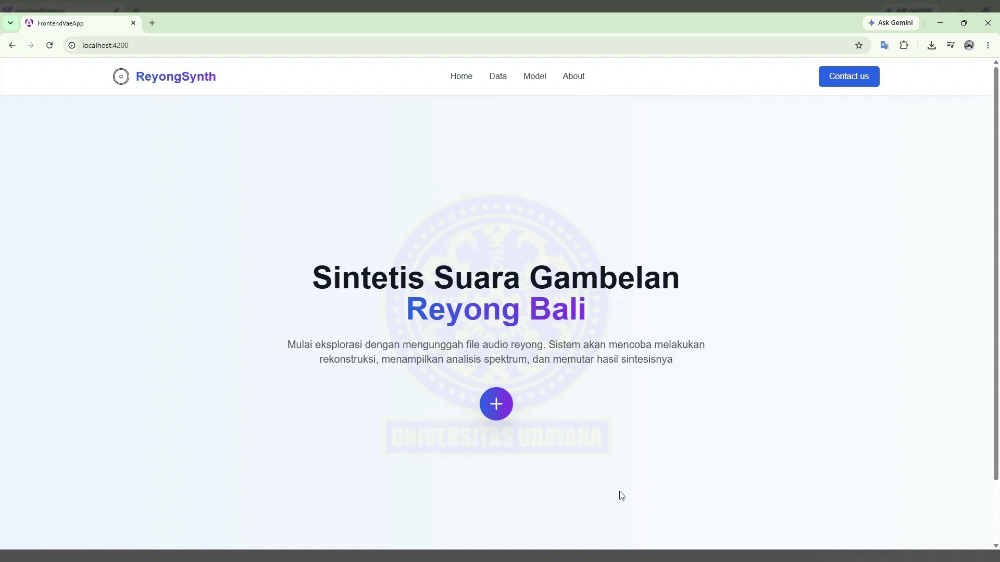

# ReyongSynth



## About

**ReyongSynth** is a research project focused on the **synthesis of traditional Balinese Reyong instrument sounds** using a **Variational Autoencoder (VAE)**.

This project was developed as part of an undergraduate thesis (final research project) in Informatics.

> **Disclaimer:** This repository is part of an undergraduate thesis research project.

## Features

* Reyong sound synthesis using a Variational Autoencoder (VAE)
* Audio file upload and processing
* Audio playback
* Visualization of audio and reconstructed spectrograms
* Web-based interface for interacting with the synthesis model

## Tech Stack

### Frontend

* Angular
* TypeScript
* Tailwind CSS

### Backend

* Python
* Flask

## Screenshot

<table>
  <tr>
    <td></td>
    <td></td>
  </tr>
  <tr>
    <td></td>
    <td></td>
  </tr>
  <tr>
    <td></td>
    <td></td>
  </tr>
  <tr>
    <td></td>
  </tr>
</table>

## Installation

### 1. Clone the Repository

```bash
git clone https://github.com/wedawesnawa/fronted-vae-app.git
cd fronted-vae-app
```

### 2. Install Dependencies

Install the required frontend dependencies:

```bash
npm install
```

### 3. Run the Application

Start the Angular development server:

```bash
npm start
```

The application will be available through the local development server.

> **Note:** The backend must also be running for the application to perform audio synthesis and communicate with the VAE model.

## Documentation

* **Figma Design:**
  https://www.figma.com/design/JeKRDkflIG7QRpffpYqfMI/webvae?t=WaQEO1yLMP1afMBm-1

* **Backend Repository:**
  https://github.com/wedawesnawa/backend-vae-app.git

## Publication

The research publication is currently **under submission**.


